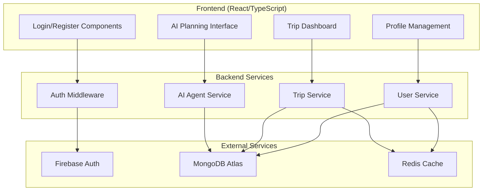
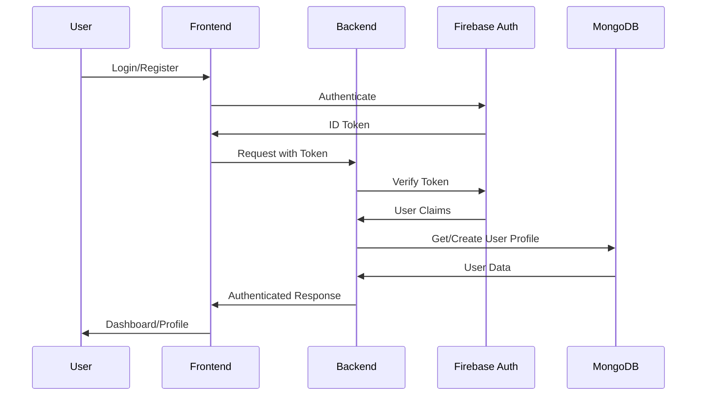
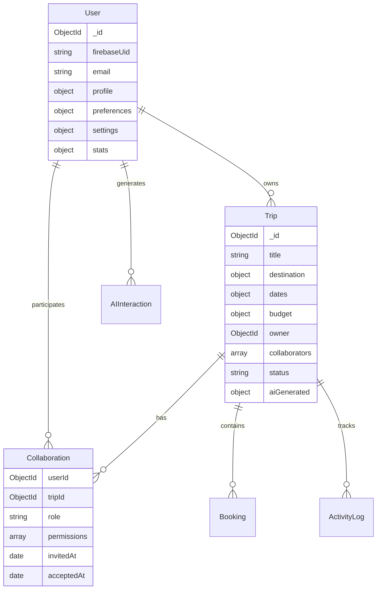

# User Authentication & Database Models - Design Document

## Overview

This design document outlines the implementation strategy for Wayra's user authentication system and database models. The system integrates Firebase Authentication for secure user management with MongoDB for data persistence, creating a robust foundation for collaborative travel planning.

The design prioritizes security, scalability, and seamless integration with Wayra's existing AI multi-agent system while supporting the platform's core vision of budget-focused, collaborative travel planning.

## Architecture

### High-Level Architecture



### Authentication Flow



## Components and Interfaces

### 1. Authentication System

#### Firebase Integration
- **Service**: Enhanced Firebase Admin SDK integration
- **Features**: Email/password, Google OAuth, social providers
- **Security**: JWT token validation, session management
- **Development Mode**: Bypass authentication for development

#### Frontend Authentication Components
```typescript
interface AuthContextType {
  user: User | null;
  loading: boolean;
  login: (email: string, password: string) => Promise<void>;
  register: (email: string, password: string, profile: UserProfile) => Promise<void>;
  logout: () => Promise<void>;
  updateProfile: (updates: Partial<UserProfile>) => Promise<void>;
}

interface User {
  uid: string;
  email: string;
  displayName: string;
  photoURL?: string;
  emailVerified: boolean;
  profile: UserProfile;
}
```

#### Backend Authentication Middleware
```javascript
// Enhanced auth middleware with user profile loading
const authMiddleware = async (req, res, next) => {
  // Token verification
  // User profile loading from database
  // Request context enhancement
};
```

### 2. Database Models

#### User Model
```javascript
const UserSchema = {
  _id: ObjectId,
  firebaseUid: String, // Firebase user ID
  email: String,
  profile: {
    displayName: String,
    firstName: String,
    lastName: String,
    photoURL: String,
    phoneNumber: String,
    dateOfBirth: Date,
    location: {
      country: String,
      city: String,
      timezone: String
    }
  },
  preferences: {
    budgetRange: {
      min: Number,
      max: Number,
      currency: String
    },
    travelStyle: [String], // ['budget', 'luxury', 'adventure', 'cultural']
    interests: [String],
    accommodationPreferences: [String],
    transportationPreferences: [String],
    dietaryRestrictions: [String],
    accessibility: [String]
  },
  settings: {
    notifications: {
      email: Boolean,
      push: Boolean,
      tripUpdates: Boolean,
      priceAlerts: Boolean
    },
    privacy: {
      profileVisibility: String, // 'public', 'friends', 'private'
      tripVisibility: String,
      allowInvitations: Boolean
    },
    ai: {
      personalizationEnabled: Boolean,
      dataUsageConsent: Boolean,
      learningFromHistory: Boolean
    }
  },
  stats: {
    tripsPlanned: Number,
    tripsCompleted: Number,
    totalBudgetSaved: Number,
    favoriteDestinations: [String],
    averageTripDuration: Number
  },
  createdAt: Date,
  updatedAt: Date,
  lastLoginAt: Date,
  isActive: Boolean
};
```

#### Trip Model
```javascript
const TripSchema = {
  _id: ObjectId,
  title: String,
  description: String,
  destination: {
    name: String,
    country: String,
    coordinates: {
      lat: Number,
      lng: Number
    }
  },
  dates: {
    start: Date,
    end: Date,
    flexible: Boolean
  },
  budget: {
    total: Number,
    currency: String,
    breakdown: {
      accommodation: Number,
      transportation: Number,
      food: Number,
      activities: Number,
      miscellaneous: Number
    },
    spent: Number,
    remaining: Number
  },
  travelers: {
    adults: Number,
    children: Number,
    infants: Number
  },
  owner: ObjectId, // User ID
  collaborators: [{
    userId: ObjectId,
    role: String, // 'owner', 'editor', 'viewer'
    invitedBy: ObjectId,
    invitedAt: Date,
    acceptedAt: Date,
    permissions: [String]
  }],
  status: String, // 'planning', 'booked', 'completed', 'cancelled'
  visibility: String, // 'private', 'shared', 'public'
  
  // AI Generated Content
  aiGenerated: {
    itinerary: Object, // Full itinerary from AI agents
    budgetAnalysis: Object,
    destinationInsights: Object,
    travelCoordination: Object,
    generatedAt: Date,
    agentVersions: Object // Track which AI versions generated content
  },
  
  // User Modifications
  customizations: [{
    type: String, // 'itinerary_change', 'budget_adjustment', etc.
    changes: Object,
    userId: ObjectId,
    timestamp: Date,
    reason: String
  }],
  
  // Collaboration History
  activityLog: [{
    userId: ObjectId,
    action: String,
    details: Object,
    timestamp: Date
  }],
  
  // Booking Information
  bookings: [{
    type: String, // 'flight', 'hotel', 'activity', 'transport'
    provider: String,
    bookingReference: String,
    status: String,
    cost: Number,
    bookedAt: Date,
    bookedBy: ObjectId
  }],
  
  tags: [String],
  createdAt: Date,
  updatedAt: Date,
  completedAt: Date
};
```

#### User Preferences Model (Embedded in User)
```javascript
const UserPreferencesSchema = {
  budget: {
    defaultCurrency: String,
    typicalRange: {
      min: Number,
      max: Number
    },
    priorityCategories: [String] // What they spend most on
  },
  travel: {
    preferredSeasons: [String],
    avoidedSeasons: [String],
    preferredDuration: {
      min: Number,
      max: Number
    },
    groupSizePreference: String,
    planningStyle: String // 'detailed', 'flexible', 'spontaneous'
  },
  ai: {
    communicationStyle: String, // 'formal', 'casual', 'enthusiastic'
    detailLevel: String, // 'brief', 'moderate', 'comprehensive'
    riskTolerance: String, // 'conservative', 'moderate', 'adventurous'
    learningConsent: Boolean
  }
};
```

### 3. Service Layer Architecture

#### User Service
```javascript
class UserService {
  async createUser(firebaseUid, email, profile) {
    // Create user profile in MongoDB
    // Set default preferences
    // Initialize user stats
  }
  
  async getUserByFirebaseUid(firebaseUid) {
    // Retrieve user with caching
    // Include preferences and stats
  }
  
  async updateUserProfile(userId, updates) {
    // Validate updates
    // Update database
    // Clear cache
    // Trigger AI personalization update
  }
  
  async updateUserPreferences(userId, preferences) {
    // Update travel preferences
    // Notify AI system of changes
    // Update personalization models
  }
  
  async getUserStats(userId) {
    // Calculate user statistics
    // Cache results
  }
}
```

#### Trip Service
```javascript
class TripService {
  async createTrip(userId, tripData) {
    // Create new trip
    // Set owner permissions
    // Initialize collaboration settings
  }
  
  async getUserTrips(userId, filters) {
    // Get user's trips with filtering
    // Include collaboration status
    // Support pagination
  }
  
  async updateTrip(tripId, userId, updates) {
    // Validate permissions
    // Update trip data
    // Log activity
    // Notify collaborators
  }
  
  async inviteCollaborator(tripId, inviterUserId, inviteeEmail, role) {
    // Send invitation
    // Create pending collaboration record
    // Send notification
  }
  
  async acceptInvitation(tripId, userId, invitationToken) {
    // Validate invitation
    // Add user as collaborator
    // Update permissions
    // Notify trip owner
  }
}
```

### 4. Integration with AI System

#### AI Context Enhancement
```javascript
// Enhanced AI context with user data
const buildAIContext = async (userId, tripData) => {
  const user = await UserService.getUserByFirebaseUid(userId);
  
  return {
    user: {
      preferences: user.preferences,
      travelHistory: await TripService.getUserCompletedTrips(userId),
      budgetPatterns: await AnalyticsService.getUserBudgetPatterns(userId),
      collaborationStyle: await AnalyticsService.getUserCollaborationStyle(userId)
    },
    trip: tripData,
    personalization: {
      enabled: user.settings.ai.personalizationEnabled,
      learningConsent: user.settings.ai.learningFromHistory
    }
  };
};
```

#### AI Agent Integration
```javascript
// Enhanced agent execution with user context
class EnhancedAgentService extends AgentService {
  async executeAgentTask(agentRole, task, context, userId) {
    // Load user context
    const userContext = await buildAIContext(userId, context);
    
    // Execute agent with enhanced context
    const result = await super.executeAgentTask(agentRole, task, {
      ...context,
      user: userContext
    });
    
    // Store AI interaction for learning
    await AIInteractionService.logInteraction(userId, agentRole, task, result);
    
    return result;
  }
}
```

## Data Models

### Database Schema Design

#### Indexing Strategy
```javascript
// User Collection Indexes
db.users.createIndex({ "firebaseUid": 1 }, { unique: true });
db.users.createIndex({ "email": 1 }, { unique: true });
db.users.createIndex({ "createdAt": -1 });
db.users.createIndex({ "lastLoginAt": -1 });

// Trip Collection Indexes
db.trips.createIndex({ "owner": 1, "createdAt": -1 });
db.trips.createIndex({ "collaborators.userId": 1 });
db.trips.createIndex({ "destination.name": 1 });
db.trips.createIndex({ "dates.start": 1, "dates.end": 1 });
db.trips.createIndex({ "status": 1 });
db.trips.createIndex({ "tags": 1 });

// Compound Indexes for Common Queries
db.trips.createIndex({ "owner": 1, "status": 1, "createdAt": -1 });
db.trips.createIndex({ "collaborators.userId": 1, "status": 1 });
```

#### Data Relationships


## Error Handling

### Authentication Errors
```javascript
class AuthError extends Error {
  constructor(code, message, details = {}) {
    super(message);
    this.name = 'AuthError';
    this.code = code;
    this.details = details;
  }
}

// Error codes
const AUTH_ERRORS = {
  INVALID_TOKEN: 'auth/invalid-token',
  TOKEN_EXPIRED: 'auth/token-expired',
  USER_NOT_FOUND: 'auth/user-not-found',
  INSUFFICIENT_PERMISSIONS: 'auth/insufficient-permissions',
  ACCOUNT_DISABLED: 'auth/account-disabled'
};
```

### Database Error Handling
```javascript
class DatabaseError extends Error {
  constructor(operation, originalError, context = {}) {
    super(`Database operation failed: ${operation}`);
    this.name = 'DatabaseError';
    this.operation = operation;
    this.originalError = originalError;
    this.context = context;
  }
}

// Retry mechanism for database operations
const withRetry = async (operation, maxRetries = 3) => {
  for (let attempt = 1; attempt <= maxRetries; attempt++) {
    try {
      return await operation();
    } catch (error) {
      if (attempt === maxRetries || !isRetryableError(error)) {
        throw new DatabaseError(operation.name, error);
      }
      await sleep(1000 * attempt); // Exponential backoff
    }
  }
};
```

## Testing Strategy

### Unit Testing
```javascript
// User Service Tests
describe('UserService', () => {
  describe('createUser', () => {
    it('should create user with default preferences', async () => {
      const userData = {
        firebaseUid: 'test-uid',
        email: 'test@example.com',
        profile: { displayName: 'Test User' }
      };
      
      const user = await UserService.createUser(userData);
      
      expect(user).toHaveProperty('preferences');
      expect(user.preferences).toHaveProperty('budgetRange');
      expect(user.stats.tripsPlanned).toBe(0);
    });
  });
});

// Trip Service Tests
describe('TripService', () => {
  describe('createTrip', () => {
    it('should create trip with owner permissions', async () => {
      const tripData = {
        title: 'Test Trip',
        destination: { name: 'Paris, France' }
      };
      
      const trip = await TripService.createTrip('user-id', tripData);
      
      expect(trip.owner).toBe('user-id');
      expect(trip.collaborators).toHaveLength(1);
      expect(trip.collaborators[0].role).toBe('owner');
    });
  });
});
```

### Integration Testing
```javascript
// Authentication Flow Tests
describe('Authentication Integration', () => {
  it('should complete full registration flow', async () => {
    // Register user
    const registerResponse = await request(app)
      .post('/api/auth/register')
      .send({
        email: 'test@example.com',
        password: 'password123',
        profile: { displayName: 'Test User' }
      });
    
    expect(registerResponse.status).toBe(201);
    
    // Login user
    const loginResponse = await request(app)
      .post('/api/auth/login')
      .send({
        email: 'test@example.com',
        password: 'password123'
      });
    
    expect(loginResponse.status).toBe(200);
    expect(loginResponse.body).toHaveProperty('token');
    
    // Access protected route
    const profileResponse = await request(app)
      .get('/api/user/profile')
      .set('Authorization', `Bearer ${loginResponse.body.token}`);
    
    expect(profileResponse.status).toBe(200);
    expect(profileResponse.body.email).toBe('test@example.com');
  });
});
```

### Performance Testing
```javascript
// Load Testing for Authentication
describe('Authentication Performance', () => {
  it('should handle concurrent login requests', async () => {
    const concurrentLogins = Array(100).fill().map(() =>
      request(app)
        .post('/api/auth/login')
        .send({ email: 'test@example.com', password: 'password123' })
    );
    
    const responses = await Promise.all(concurrentLogins);
    const successfulLogins = responses.filter(r => r.status === 200);
    
    expect(successfulLogins.length).toBe(100);
    
    // Check response times
    const responseTimes = responses.map(r => r.duration);
    const averageTime = responseTimes.reduce((a, b) => a + b) / responseTimes.length;
    
    expect(averageTime).toBeLessThan(2000); // Under 2 seconds
  });
});
```

## Security Considerations

### Data Protection
- **Encryption at Rest**: Sensitive user data encrypted in MongoDB
- **Encryption in Transit**: All API communications over HTTPS
- **PII Handling**: Personal information properly classified and protected
- **Data Retention**: Automated cleanup of expired sessions and deleted accounts

### Access Control
- **Role-Based Permissions**: Trip collaborators have specific role-based access
- **API Authorization**: All endpoints validate user permissions
- **Resource Isolation**: Users can only access their own data and shared trips
- **Audit Logging**: All sensitive operations logged for security monitoring

### Privacy Compliance
- **GDPR Compliance**: Data export and deletion capabilities
- **User Consent**: Explicit consent for AI personalization and data usage
- **Privacy Settings**: Granular control over data sharing and visibility
- **Data Minimization**: Only collect and store necessary user information

This design provides a robust, scalable foundation for Wayra's user authentication and data management needs while seamlessly integrating with the existing AI system and supporting future collaborative features.