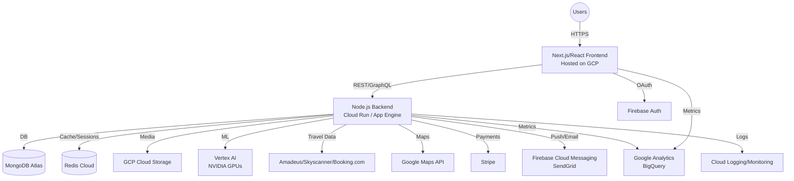

# Wayra Product Requirements Document (PRD)

---

## 1. Vision and Purpose

**What problem are we solving?**  
Wayra encourages more people to take time off, go on vacation, and plan trips with friends and family. Our mission is to make trip planning easy, collaborative, and budget-friendly—removing the unknowns from leaving home to returning, so users can focus on enjoying their journeys.

**Why does Wayra exist?**  
Wayra is a one-stop solution for every step of travel: from planning and booking, to daily itineraries and local insights. Users can plan every detail—what to do, where to stay and eat, how to get there, and what to expect—seamlessly, with smart, personalized, and collaborative tools.

---

## 2. Target Audience

- **Families:** Simplifying memorable family vacations.
- **Groups of Friends:** Easy, fun coordination for friend groups.
- **Solo Travelers:** Confident, personalized exploration.
- **Couples:** Seamless planning for shared experiences.

---

## 3. Goals & Success Metrics

**What does success look like?**
- Wayra becomes the preferred platform for collaborative, intelligent, and budget-aware trip planning.
- Users effortlessly plan, customize, and book complete trips within budget and with peace of mind.
- Wayra is recognized for smart recommendations, local insights, and real-time collaboration.

**How will you measure progress? (KPIs, Adoption, Engagement)**
- **Monthly Active Users (MAU)**
- **Trips Planned per User**
- **Collaborative Engagement Rate:** % of trips involving 2+ users
- **Budget Adherence:** % of trips within set budget
- **Itinerary Adjustment Rate:** # of smart recommendations/alerts acted upon per trip
- **Booking Conversion Rate**
- **User Satisfaction/NPS**
- **Churn Rate**

---

## 4. Core Features & User Flows

### 4.1 Core Features

#### Trip Creation & Planning
- Participant management (invite, collaborate)
- Capture trip basics: destination, dates, duration, budget
- Preference capture: travel mode, comfort, accommodation, interests

#### Smart Itinerary Builder
- AI-based recommendations and itinerary creation
- Dynamic suggestions and local insights
- Editable, collaborative plans

#### Budget-aware Booking & Alerts
- Real-time budget tracking and smart alerts
- One-click booking if a package fits within budget

#### Advice, Guidance, and Local Insights
- Contextual advice (timing, travel time, crowds)
- Price forecasting (historical/AI-driven)

#### Must-Visit & Logistics
- Must-visit suggestions based on interests
- Logistics planner: travel times, optimal routes

### 4.2 User Flows

- Start a trip → Invite participants → Set preferences & budget → Auto-generated itinerary → Collaborative editing → Smart alerts & advice → Booking → In-trip support → Post-trip sharing

### 4.3 Must-Haves vs. Nice-to-Haves

| Must-Haves                                                  | Nice-to-Haves                      |
|-------------------------------------------------------------|------------------------------------|
| Add travelers & collaborate                                 | Social sharing/export of itinerary |
| Enter trip details and preferences                          | Loyalty/points system              |
| Dynamic, editable itinerary with smart suggestions          | Travel insurance integration       |
| Budget tracking, alerts, and booking                        | Local events integration           |
| Interest-based recommendations and must-visit suggestions   | In-app photo album                 |
| Travel time/logistics planning                              | AR features for navigation         |
| Contextual advice/local guide                               | Weather forecast integration       |
| Price forecasting/alerts                                    |                                    |

### 4.4 Unique Differentiators

- **Budget-Driven Planning & Auto-Booking**
- **AI-Powered Price Intelligence**
- **Collaborative, Adaptive Itineraries**
- **Local Experience Layer**

---

## 5. The "How" (High-Level Solution)

### Platforms & Technologies

- **Cloud Provider:** Google Cloud Platform (GCP)
    - **Compute:** Cloud Run (containerized backend), App Engine (managed app hosting), Cloud Functions (event-driven logic)
    - **Storage:** Cloud Storage (media/files), Firestore (optional for real-time data)
    - **CI/CD:** Cloud Build, Artifact Registry
    - **Monitoring:** Cloud Logging, Cloud Monitoring
    - **Maps:** Google Maps Platform
- **AI/ML:** Vertex AI for recommendations, price prediction, leveraging NVIDIA GPU credits for ML workloads.
- **Database:** MongoDB Atlas (credits) for main data store; Redis Enterprise Cloud (credits) for caching, sessions, and real-time features.
- **Frontend:** React (Next.js), TypeScript, TailwindCSS or Material UI.
- **Backend:** Node.js (Express or NestJS), REST/GraphQL API, running on Cloud Run or App Engine.
- **Auth:** Firebase Authentication (with Google OAuth).
- **Notifications:** Firebase Cloud Messaging (push), SendGrid (email).
- **Payments:** Stripe.
- **Analytics:** Google Analytics, BigQuery.

### Integrations in Scope

- Google Maps Platform (location, distance, overlays)
- Stripe (payments)
- Skyscanner/Amadeus/Booking.com APIs (travel data)
- Redis/MongoDB
- NVIDIA GPU for ML

---

## 6. Edge Cases, Risks, and Out-of-Scope Items

### Out of Scope / Deliberately Postponed
- Non-GCP primary deployments (AWS/Azure)
- Advanced loyalty/reward systems
- Deep local business partnerships (initial launch)
- Multi-currency and multi-language support (post-MVP)
- Standalone mobile app (unless critical user demand)
- Full-featured travel blog/UGC

### Potential Blockers / Risks
- Third-party API reliability (rate limits, costs, data gaps)
- Real-time collaboration complexity (latency, conflict resolution)
- ML model performance and usability
- Data privacy and regulatory compliance (GDPR, PCI DSS)
- Scaling during peak travel periods
- Cost management across GCP, MongoDB, and Redis

---

## 7. Timeline & Milestones

| Milestone        | Target Date | Owner    | Status  |
|------------------|-------------|----------|---------|
| PRD Finalization | YYYY-MM-DD  | Product  | Planned |
| MVP Design       | YYYY-MM-DD  | Design   |         |
| MVP Build        | YYYY-MM-DD  | Eng      |         |

---

## 8. Cloud Architecture Diagram

---

## 9. GCP Service Recommendations

- **Cloud Run:** For scalable, containerized backend services (Node.js API).
- **App Engine:** Alternative for managed app hosting (if not using Cloud Run).
- **Cloud Functions:** For event-driven tasks (e.g., notifications, webhooks).
- **Cloud Storage:** For user uploads, media, and static assets.
- **Firestore (optional):** For real-time data needs (e.g., chat, live collaboration).
- **Vertex AI:** For ML model training/deployment (recommendations, price prediction); use NVIDIA GPU credits for heavy workloads.
- **VPC & IAM:** For secure networking and access control.
- **Cloud Build & Artifact Registry:** For CI/CD and container image management.
- **Cloud Logging & Monitoring:** For observability and alerting.
- **Google Maps Platform:** For all mapping, distance, and geolocation features.
- **Firebase Authentication:** For user auth and social login.
- **BigQuery:** For analytics and data warehousing.
- **Secret Manager:** For securing API keys and secrets.

**Third-party (using credits):**
- **MongoDB Atlas:** Main document database.
- **Redis Cloud:** Cache, session storage, and real-time features.
- **NVIDIA:** For ML workloads via Vertex AI/NVIDIA integration.

---

## 10. Appendix

- Glossary (Wayra, itinerary, collaborative planning, etc.)
- Market research and user personas
- User journey diagrams (attach as needed)
- Wireframes (link or attach as needed)

---

*All infrastructure should maximize the use of Google Cloud, NVIDIA, MongoDB, and Redis credits for cost efficiency during development and early growth.*