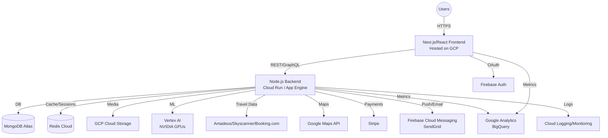

# Wayra MVP Architecture Overview

---

## 1. High-Level Diagram

---

## 2. Component Breakdown

### 2.1 Frontend (WebApp)
- **Tech:** Next.js (React), TypeScript, TailwindCSS/Material UI
- **Hosting:** GCP (Cloud Run, App Engine, or Firebase Hosting)
- **Integrations:** Google Maps, OAuth (Firebase), Analytics

### 2.2 Backend (API)
- **Tech:** Node.js (Express or NestJS)
- **Deployment:** GCP Cloud Run (preferred for scaling), alternative: App Engine
- **Integrations:** MongoDB Atlas (main data), Redis Cloud (realtime), Vertex AI (recommendations), 3rd-party APIs, Stripe, email/SMS/push

### 2.3 Databases & Caching
- **MongoDB Atlas:** User, trip, itinerary, preferences data
- **Redis Cloud:** Real-time collaboration state, session management

### 2.4 AI/ML
- **Vertex AI:** Recommendations engine, price forecasting, leveraging NVIDIA GPU credits

### 2.5 3rd-Party Integrations
- **Travel APIs:** Amadeus/Skyscanner/Booking.com for flights/hotels/activities
- **Stripe:** Payments (MVP: deep-link, future: in-app)
- **Google Maps Platform:** Geolocation, routing, points of interest

### 2.6 Auth & Notifications
- **Firebase Auth:** User authentication
- **Firebase Cloud Messaging/SendGrid:** Push and email notifications

### 2.7 Storage
- **GCP Cloud Storage:** Media, user uploads, documents

### 2.8 Analytics & Monitoring
- **Google Analytics/BigQuery:** User/product analytics
- **Cloud Logging/Monitoring:** Application and infrastructure monitoring

---

## 3. DevOps & Environment

- **CI/CD:** Google Cloud Build for build/test/deploy
- **Environments:** Dev, Staging, Production (isolated GCP projects)
- **Secrets Management:** GCP Secret Manager
- **IaC (optional):** Terraform or Google Deployment Manager for infrastructure as code

---

## 4. Security & Compliance

- **OAuth+JWT:** For secure user sessions
- **GCP IAM:** Principle of least privilege for service accounts
- **Data at rest & in transit:** Encryption via GCP/MongoDB/Redis
- **GDPR/PCI:** Compliant by design (no sensitive payment data stored)

---

## 5. Key Architectural Decisions

| Area                | Decision/Stack                                     | Reasoning                                               |
|---------------------|----------------------------------------------------|---------------------------------------------------------|
| Cloud Provider      | Google Cloud Platform                              | Credits, scalability, services synergy                  |
| Database            | MongoDB Atlas                                      | Credits, flexible schema, rapid prototyping             |
| Real-time           | Redis Cloud                                        | Credits, best for live collab/session                   |
| AI/ML               | Vertex AI + NVIDIA                                 | Credits, scalable, managed ML pipelines                 |
| Frontend            | Next.js (React)                                    | SSR, SEO, strong ecosystem                              |
| Backend             | Node.js (Express/NestJS) on Cloud Run              | Fast, scalable, easy to deploy                          |
| Auth/Notif          | Firebase (Auth, FCM), SendGrid                     | Fast, secure, no custom infra needed                    |
| Travel APIs         | Integrate, not build                               | Focus on orchestration, not inventory                   |
| CI/CD               | Google Cloud Build                                 | Seamless with GCP                                       |

---

## 6. Next Steps

1. Finalize tech stack and architecture with the team.
2. Set up repos and GCP projects/environments.
3. Start with basic skeletons for frontend and backend.
4. Integrate core auth, database, and 1-2 third-party APIs as “walking skeleton.”
5. Parallel: Design main user flows and wireframes.

---

*Let me know if you want a more detailed sequence diagram, data model draft, or a prioritized setup checklist!*